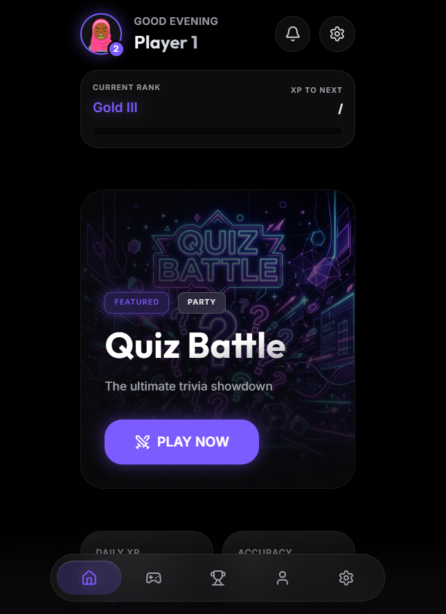
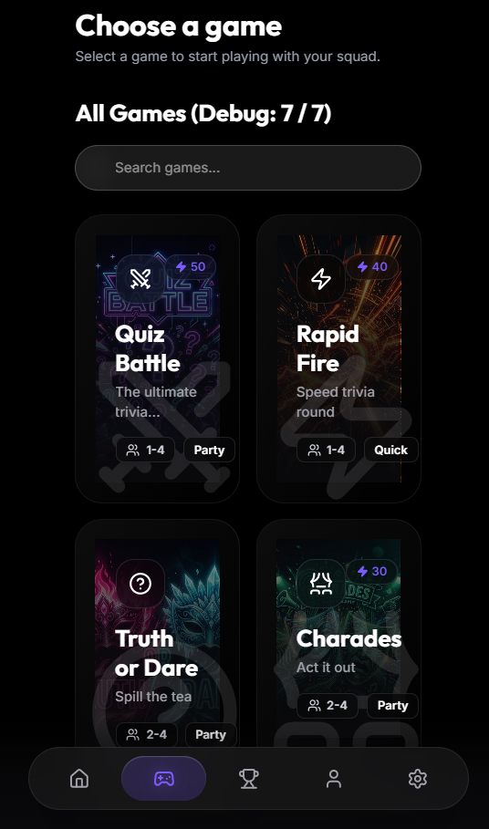
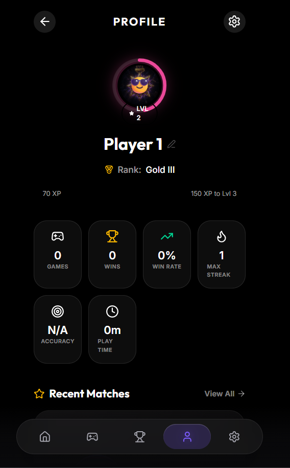
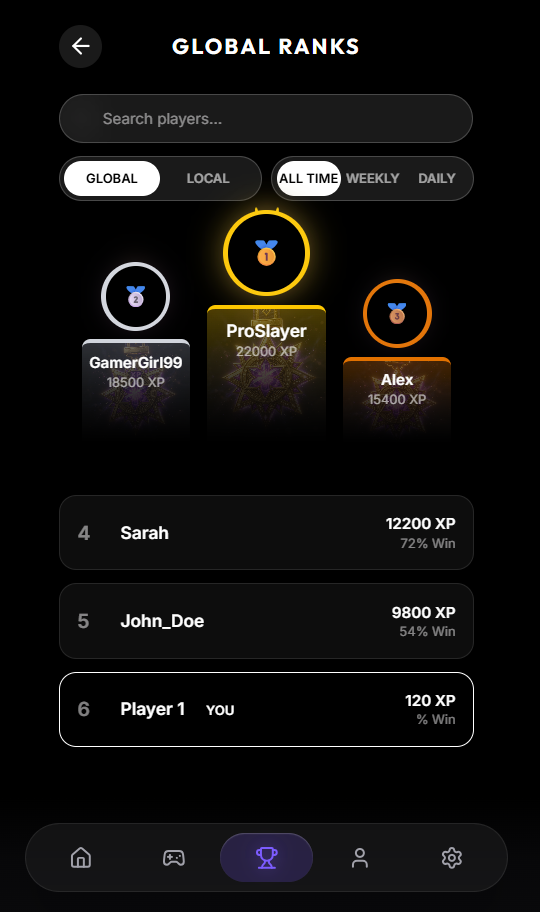
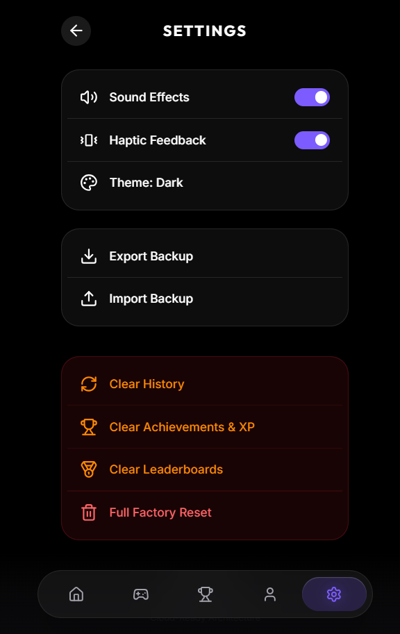
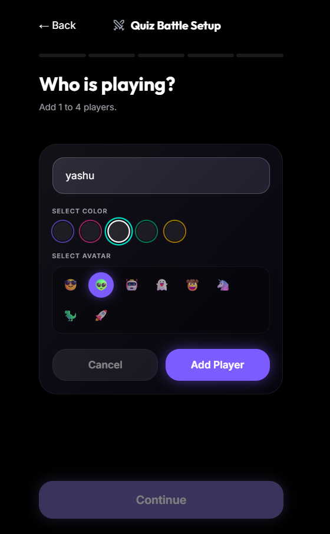

<div align="center">

# 🎮 SquadPlay

### The Ultimate Offline Party Gaming Platform

*A premium offline multiplayer gaming experience built with React, Vite & Framer Motion.*

<p align="center">

<a href="https://squadplay-gray.vercel.app/">

</a>

<a href="https://github.com/26yashu/squadplay/stargazers">

</a>


</p>

</div>

---

# 🌐 Live Demo

## https://squadplay-gray.vercel.app/

---

# 📱 Preview

<p align="center">

</p>

---

# ✨ About

SquadPlay is a **modern offline multiplayer party gaming platform** designed for friends and families to enjoy fun games together on a single device.

Inspired by modern gaming ecosystems such as **PlayStation**, **Xbox**, **Discord**, and **Supercell**, SquadPlay combines beautiful UI, smooth animations, player progression, achievements, and premium mobile-first design into one application.

Unlike traditional multiplayer games, SquadPlay works **completely offline** using Local Storage, making it fast, lightweight, and accessible anywhere.

---

# 🚀 Features

## 🎮 Party Games

- 🧠 Quiz Battle
- ⚡ Rapid Fire
- 🎭 Charades
- 😈 Truth or Dare
- ❌ Tic Tac Toe
- 🎡 Spin Wheel
- 🎲 Ludo

---

## 👤 Player Profiles

- Multiple Players
- Avatar Selection
- Color Customization
- XP Progression
- Rank System
- Match History

---

## 🏆 Progression

- XP Rewards
- Gold Ranking
- Statistics
- Daily Streak
- Accuracy Tracking
- Leaderboards
- Achievement Ready

---

## 🎨 Premium UI/UX

- Glassmorphism
- Dark Theme
- Floating Navigation
- Responsive Design
- Console-inspired UI
- Smooth Micro-interactions
- Framer Motion Animations

---

## ⚡ Performance

- Fully Offline
- Zero Backend
- Local Storage Persistence
- Fast Loading
- Optimized React Components

---

# 📸 Screenshots

## 🏠 Home

<p align="center">

</p>

---

## 🎮 Games Library

<p align="center">

</p>

---

## 👤 Player Profile

<p align="center">

</p>

---

## 🏆 Leaderboard

<p align="center">

</p>

---

## ⚙️ Settings

<p align="center">

</p>

---

## 👥 Player Setup

<p align="center">

</p>

---

# 🎲 Games Included

| Game | Players | Status |
|-------|----------|--------|
| Quiz Battle | 1–4 | ✅ |
| Rapid Fire | 1–4 | ✅ |
| Truth or Dare | 2–4 | ✅ |
| Charades | 2–4 | ✅ |
| Tic Tac Toe | 2 | ✅ |
| Spin Wheel | 1–4 | ✅ |
| Ludo | 2–4 | ✅ |

---

# 🏗 Architecture

```
SquadPlay
│
├── public/
│
├── src/
│
├── components/
│
├── pages/
│
├── games/
│   ├── Quiz Battle
│   ├── Rapid Fire
│   ├── Charades
│   ├── Truth or Dare
│   ├── Tic Tac Toe
│   ├── Spin Wheel
│   └── Ludo
│
├── hooks/
│
├── router/
│
├── contexts/
│
├── setup/
│
├── utils/
│
└── assets/
```

---

# 🛠 Tech Stack

### Frontend

- React 19
- Vite
- JavaScript (ES6+)

### Styling

- Tailwind CSS
- CSS Variables
- Glassmorphism

### Animations

- Framer Motion

### Routing

- React Router

### Icons

- Lucide React

### Storage

- Browser LocalStorage

---

# 🚀 Installation

Clone the repository

```bash
git clone https://github.com/26yashu/squadplay.git
```

Move into the project

```bash
cd squadplay
```

Install dependencies

```bash
npm install
```

Run development server

```bash
npm run dev
```

Open

```
http://localhost:5173
```

---

# 📦 Production Build

```bash
npm run build
```

Preview Production

```bash
npm run preview
```

---

# 📈 Future Roadmap

- 🌍 Online Multiplayer
- 🔐 Firebase Authentication
- ☁ Cloud Save
- 👥 Friends System
- 🎤 Voice Chat
- 🎯 Daily Challenges
- 🏆 Tournament Mode
- 🤖 AI Opponents
- 🎮 Game Marketplace
- 📱 Progressive Web App (PWA)

---

# 💡 Highlights

✅ Modern Mobile UI

✅ Console Inspired Design

✅ Offline Multiplayer

✅ Glassmorphism

✅ XP & Ranking System

✅ Responsive Layout

✅ Premium Animations

✅ Scalable Architecture

---

# 🤝 Contributing

Contributions are always welcome!

1. Fork this repository

2. Create your feature branch

```bash
git checkout -b feature/amazing-feature
```

3. Commit your changes

```bash
git commit -m "Added amazing feature"
```

4. Push your branch

```bash
git push origin feature/amazing-feature
```

5. Open a Pull Request

---

# 👨‍💻 Developer

## Yashu

**B.Tech CSE (Artificial Intelligence & Machine Learning)**

Passionate about

- AI & Machine Learning
- Full Stack Development
- Modern UI/UX
- React Applications
- Computer Vision
- Generative AI

### Connect

- GitHub: https://github.com/26yashu

---

# 📄 License

Distributed under the MIT License.

See `LICENSE` for more information.

---

# ⭐ Support

If you liked this project,

⭐ Star the repository

🍴 Fork it

🐞 Report Issues

💙 Share it with your friends

---

<div align="center">

## 🎮 Play • Compete • Level Up

### Made with ❤️ using React, Vite & Framer Motion

</div>
